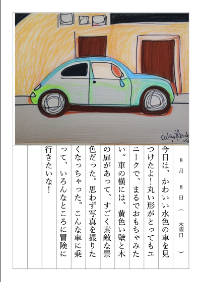

# AI嘘日記

## 概要
AI嘘日記は、OpenAIのGPT-4o miniを使用して、入力された写真に対してスタイル転送によるイラスト化を行い、その結果を元にAIが嘘の日記を生成するWebアプリです。
img2imgの使用モデルは、[CompVis/stable-diffusion-v1-4](https://huggingface.co/CompVis/stable-diffusion-v1-4)を使用しています。

## サンプル
### 入力写真

### 出力PDF


## 使い方
1. OpenAIのAPIキーを取得し、[app.py](app.py)の`OPEN_AI_API_KEY`に設定 ※GPT-4o miniを使用
1. [`app.py`](app.py)を実行してコンソールに表示されるURLにアクセスすると、AI嘘日記のWebアプリが起動
1. 画像をアップロードし、実行ボタンを押すと、AI嘘日記が生成 ※写真サイズは最大1MB
1. しばらくすると、webページが更新されpdfファイルが表示

## モジュールのインストール
cuda12.4の場合
```
pip install flask
pip install torch torchvision torchaudio --index-url https://download.pytorch.org/whl/cu124
pip install transformers
pip install openai
pip install docx2pdf
pip install python-docx
```

## 参考URL
- [python-docxによるWordファイル操作方法のまとめ
](https://gammasoft.jp/support/how-to-use-python-docx-for-word-file/)
- [CompVis/stable-diffusion-v1-4](https://huggingface.co/CompVis/stable-diffusion-v1-4)
- [GPT-4oは画像の座標情報を理解しているのか？](https://note.com/asahi_ictrad/n/n1fed804c0fcf)